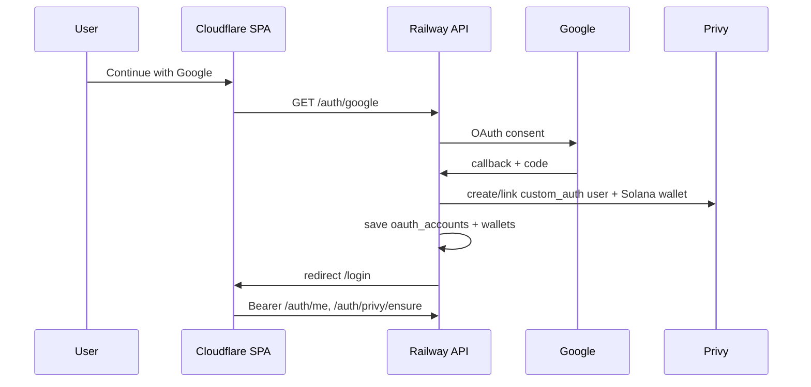

# Pocketpull — Platform documentation

Technical overview of the Pocketpull stack for developers, operators, and demo recordings.

## Internal documentation (start here)

**[docs/README.md](docs/README.md)** — full index: architecture, auth, API catalog, product (Masterdoc summary), rewards, CC integrations, ops runbooks, implementation status.

| Quick links | |
| --- | --- |
| [Local development](docs/getting-started/local-development.md) | [Staging](docs/getting-started/staging.md) |
| [Authentication](docs/architecture/authentication.md) | [Backend API](docs/architecture/backend-api-reference.md) |
| [Product overview](docs/product/product-overview.md) | [Masterdoc (UX spec)](docs/reference/Masterdoc.md) |
| [Rewards & PP](docs/product/rewards-and-gamification.md) | [Implementation status](docs/changelog/implementation-status.md) |

> **GitHub org profile:** The org homepage reads from `profile/README.md` in the [**Pocketpull/.github**](https://github.com/Pocketpull/.github) repository (or this repo if you configure it that way). Keep `profile/README.md` in sync when you update the cover page.

## Demo video

Platform walkthrough (hosted on the org profile repo):

<video src="https://github.com/Pocketpull/.github/raw/main/profile/assets/platform-walkthrough.mp4" width="720" controls>
  <a href="https://github.com/Pocketpull/.github/raw/main/profile/assets/platform-walkthrough.mp4">Watch or download</a>
</video>

Also on [github.com/Pocketpull](https://github.com/Pocketpull) org homepage.

---

## Repository map

| Repository | URL | Deploy target |
| ---------- | --- | ------------- |
| Frontend | https://github.com/Pocketpull/Frontend | Cloudflare Pages |
| Backend | https://github.com/Pocketpull/Backend | Railway |
| Platform (this repo) | https://github.com/Pocketpull/Pocketpull | Docs only |

---

## Architecture

### Request path (production)

```
User browser
  → https://frontend-9a5.pages.dev (or pocketpull.io)
  → VITE_API_URL=https://pocketpull-production.up.railway.app
  → Authorization: Bearer <session>
  → Fastify routes (register.ts, privy-auth.ts, …)
  → PostgreSQL (pocketpull-db)
```

### Authentication sequence



| Step | Component | Detail |
| ---- | --------- | ------ |
| 1 | Frontend | `Login.tsx` links to `{API}/auth/google` |
| 2 | Backend | `register.ts` Google routes; state encodes `origin`, `ref`, `next` |
| 3 | Callback | Upsert user + Google `oauth_accounts` row |
| 4 | Privy | `ensure-privy-wallet.ts` — `users.create` with `custom_auth` + Solana wallet |
| 5 | Redirect | `{returnOrigin}/login#pp_token={session}` |
| 6 | SPA | `main.tsx` reads hash → `setSessionBearerToken` before React render |
| 7 | Bootstrap | `privy-wallet-bootstrap.tsx` calls `POST /auth/privy/ensure` if needed |

Email/password auth was removed. Privy is **wallet provisioning**, not a separate login screen.

---

## Infrastructure matrix

### Production

| Layer | Service | Branch / name | URL |
| ----- | ------- | ------------- | --- |
| Frontend | Cloudflare Pages | `main` | https://frontend-9a5.pages.dev |
| Frontend CDN | Custom domain | — | https://pocketpull.io |
| API | Railway `pocketpull` | `main` deploy | https://pocketpull-production.up.railway.app |
| Database | Railway `pocketpull-db` | — | (private) |

### Staging

| Layer | Service | Branch / name | URL |
| ----- | ------- | ------------- | --- |
| Frontend | CF **Preview** | `staging` | `https://<preview>.frontend-9a5.pages.dev` (from Deployments) |
| API | Railway `Staging-pp` | staging deploy | https://staging-pp-production.up.railway.app |
| Database | Railway `Staging-db` | — | (private) |

**Rules**

- Staging frontend → staging API only (`VITE_API_URL` in CF **Preview** env).
- Staging API `WEB_ORIGIN` must include the staging preview URL (not production domains).
- Separate `SESSION_SECRET` and DB; never share production Postgres.

---

## Environment variables (cheat sheet)

### Cloudflare Pages — Production

See `Frontend/.env.example`:

- `VITE_API_URL=https://pocketpull-production.up.railway.app`
- `VITE_PRIVY_APP_ID`, `VITE_ENABLE_PRIVY_AUTH`, Solana RPC vars as needed

### Cloudflare Pages — Preview (staging branch)

See `Frontend/.staging.env`:

- `VITE_API_URL=https://staging-pp-production.up.railway.app`
- Prefer `VITE_SOLANA_NETWORK=devnet` on staging

### Railway — Production (`pocketpull`)

See `Backend/.env.example` — required highlights:

- `WEB_ORIGIN` — `https://frontend-9a5.pages.dev,https://pocketpull.io,http://localhost:8008`
- `API_PUBLIC_URL` — production Railway URL
- `GOOGLE_CLIENT_ID`, `GOOGLE_CLIENT_SECRET`
- `ENABLE_PRIVY_AUTH`, `PRIVY_APP_ID`, `PRIVY_APP_SECRET`
- `DATABASE_URL` — from `pocketpull-db` plugin

### Railway — Staging (`Staging-pp`)

See `Backend/.staging.env` — same shape, different secrets and URLs.

---

## Google OAuth (both environments)

**Authorized JavaScript origins:** every frontend origin (local + CF URLs).

**Redirect URIs (API host):**

| Environment | Redirect URI |
| ----------- | ------------ |
| Local | `http://localhost:8080/auth/google/callback` |
| Production | `https://pocketpull-production.up.railway.app/auth/google/callback` |
| Staging | `https://staging-pp-production.up.railway.app/auth/google/callback` |

---

## Privy

- **Dashboard:** PocketPull Dev app; embedded **Solana** wallets on.
- **Allowed origins:** all `WEB_ORIGIN` frontends + localhost.
- **Server path (primary):** App ID + secret on Railway; wallet created on Google callback.
- **Optional client path:** Third-party auth plugin + JWT verification if enabling browser Privy sync.

---

## Publishing this repo

### Option A — Org profile (recommended for “cover page”)

GitHub shows `profile/README.md` from a repo named **`.github`** on the org:

```bash
cd pocketpull-platform
git init
git add profile/README.md
git commit -m "Add org profile README"
git remote add origin https://github.com/Pocketpull/.github.git
git push -u origin main
# Ensure profile/README.md is on the default branch
```

### Option B — Standalone docs repo

```bash
git remote add origin https://github.com/Pocketpull/Pocketpull.git
git push -u origin main
```

Copy or symlink `profile/README.md` into `.github` if you want both.

---

## Local development checklist

- [ ] Postgres running; `DATABASE_URL` in Backend `.env`
- [ ] `WEB_ORIGIN=http://localhost:8008` on API
- [ ] `API_PUBLIC_URL=http://localhost:8080`
- [ ] Google OAuth redirect `http://localhost:8080/auth/google/callback`
- [ ] `VITE_API_URL=http://localhost:8080` in Frontend `.env`
- [ ] `npm run db:migrate && npm run db:seed` in Backend
- [ ] `npm run dev` both services (8008 + 8080)

---

## Further reading

- [Frontend README](https://github.com/Pocketpull/Frontend/blob/main/README.md)
- [Backend README](https://github.com/Pocketpull/Backend/blob/main/README.md)
