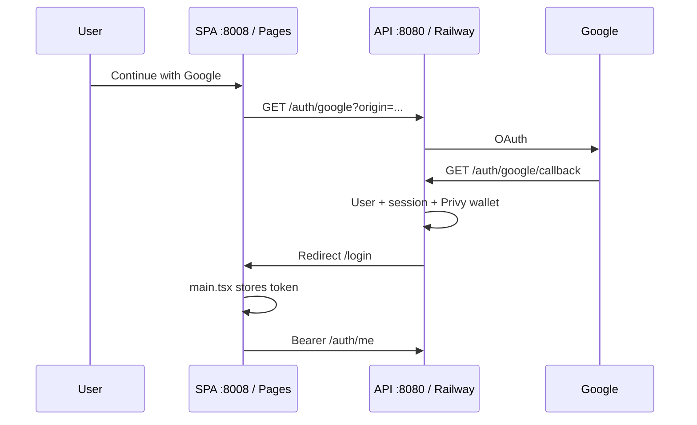

# Authentication & sessions

Production login is **Google OAuth only**. Sessions are **Bearer tokens** so the SPA (Cloudflare) and API (Railway) can live on different origins.

## Flow

## Implementation map

| Piece | Location |
| ----- | -------- |
| Start OAuth | `backend/src/routes/register.ts` — `GET /auth/google` |
| Callback | `GET /auth/google/callback` on **API host** |
| OAuth state (return origin) | `backend/src/lib/google-oauth-state.ts` |
| Allowed origins | `backend/src/lib/web-origin.ts` |
| Token in URL hash | `frontend/src/lib/session-token.ts` |
| Before React render | `frontend/src/main.tsx` |
| Session store + `/auth/me` | `frontend/src/providers/auth-provider.tsx` |
| Login UI | `frontend/src/pages/Login.tsx` |

## Session transport

- After callback, API redirects to `{origin}/login#pp_token={sessionId}`.
- Frontend reads the hash **before** React mounts and stores the token (`session-token.ts`).
- `api()` attaches `Authorization: Bearer <token>` on every request.
- Cookies are not relied on for cross-origin production (Pages ≠ Railway).

## Endpoints

| Method | Path | Auth | Purpose |
| ------ | ---- | ---- | ------- |
| GET | `/auth/google` | — | Start OAuth (`?ref=`, `?next=`) |
| GET | `/auth/google/callback` | — | OAuth callback |
| GET | `/auth/me` | Bearer | User, cosmetics, wallet flags |
| POST | `/auth/logout` | Bearer | End session |

`/auth/me` includes `privyLinked`, `solanaWalletLinked`, `solanaWallets`, `privySolanaWallets`.

## Removed / not used

- Email/password register and login (removed).
- Privy as a **login** screen (wallet only — see [privy-and-wallets.md](privy-and-wallets.md)).
- Apple Sign-In — planned.

## Discord (link only)

| Method | Path |
| ------ | ---- |
| POST | `/auth/discord/link/start` |
| GET | `/auth/discord/callback` |
| POST | `/auth/discord/unlink` |

## Design decisions

| Topic | Decision |
| ----- | -------- |
| Redirect URI | Always `{API_PUBLIC_URL}/auth/google/callback`, not Vite port |
| Return URL | Must be listed in `WEB_ORIGIN` |
| Production frontend | `frontend-9a5.pages.dev`, `pocketpull.io` |
| Staging | Separate secrets; preview URL in `WEB_ORIGIN` |

## Masterdoc alignment

[Masterdoc §6](../reference/Masterdoc.md) described Gmail + wallet login in the **prototype**. Production uses **Google OAuth** + automatic Privy wallet — update UX copy accordingly.
