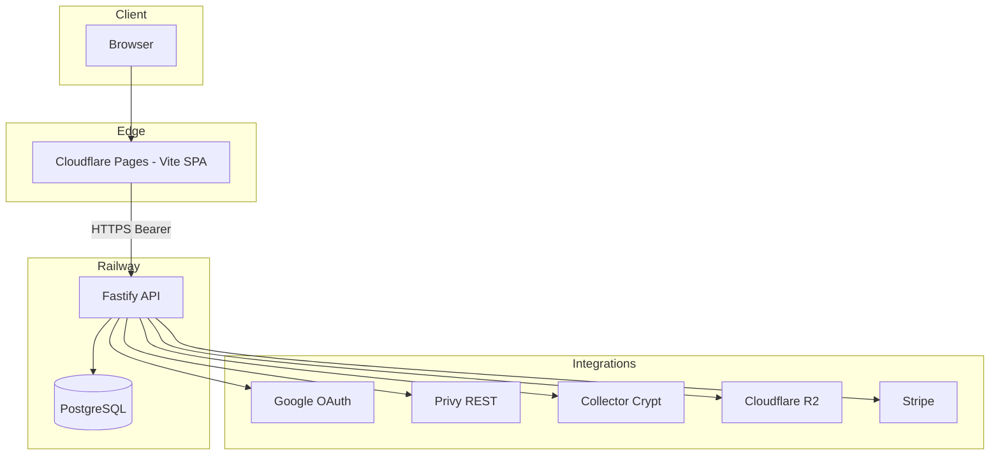

# System overview

## Topology

## Repositories & deploy

| Component | Repo | Runtime |
| --------- | ---- | ------- |
| SPA | [Pocketpull/Frontend](https://github.com/Pocketpull/Frontend) | Cloudflare Pages (`dist/`) |
| API | [Pocketpull/Backend](https://github.com/Pocketpull/Backend) | Railway (`npm run start` after `db:migrate`) |
| Docs | [Pocketpull/Pocketpull](https://github.com/Pocketpull/Pocketpull) | GitHub |

## Request path (authenticated)

1. User loads SPA from Cloudflare.
2. `api()` in `frontend/src/lib/api.ts` sends `Authorization: Bearer <session>` to `VITE_API_URL`.
3. Fastify validates session, runs route handler, reads/writes Postgres.
4. CC calls are **server-side only** — credentials never exposed to the browser.

## Major subsystems

| Subsystem | Backend | Frontend |
| --------- | ------- | -------- |
| Auth | `register.ts`, `privy-auth.ts` | `auth-provider.tsx`, `Login.tsx`, `session-token.ts` |
| Gacha / slab roll | `register.ts`, `gacha-pool-sync*` | `/slab-roll`, `/gacha` |
| Inventory / vault | `register.ts` | `/vault` |
| Marketplace | `collector-crypt-marketplace.ts` | `/marketplace` |
| Rewards / PP | `register.ts`, `gamification*` | `/rewards`, `/badges` |
| Binder / quests | `binder-pokemon.ts`, `collection-quests.ts` | `/binder` |
| Admin | `admin-*.ts` | `/admin/*` |

## Cluster header

The SPA sends `X-PocketPull-Solana-Cluster: devnet|mainnet` so the API selects matching Collector Crypt hosts and RPC config.

## Related docs

- [authentication.md](authentication.md)
- [privy-and-wallets.md](privy-and-wallets.md)
- [backend-api-reference.md](backend-api-reference.md)
- [frontend-routes.md](frontend-routes.md)
