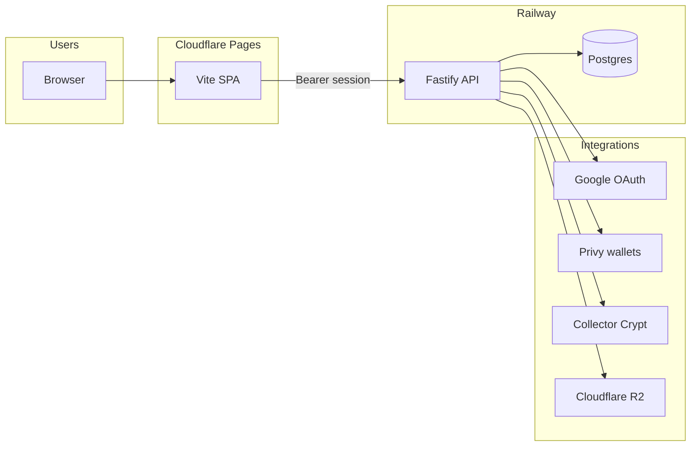

<div align="center">

[](https://pocketpull.io)

<br />


&nbsp;&nbsp;


<br /><br />

**Open packs. Pull slabs. Vault your collection — on Solana.**

<br />

[](https://pocketpull.io)
[](https://frontend-9a5.pages.dev)
[](https://pocketpull-production.up.railway.app/health)

<br />

[](https://github.com/Pocketpull/Frontend)
[](https://github.com/Pocketpull/Frontend)
[](https://github.com/Pocketpull/Frontend)
[](https://github.com/Pocketpull/Backend)
[](https://github.com/Pocketpull/Backend)
[](https://github.com/Pocketpull/Backend)
[](https://github.com/Pocketpull/Frontend)

<br />

[Live app](https://pocketpull.io) · [Frontend](https://github.com/Pocketpull/Frontend) · [Backend](https://github.com/Pocketpull/Backend) · [Platform docs](https://github.com/Pocketpull/Pocketpull)

</div>

---

## Platform walkthrough

<div align="center">

<video src="https://github.com/Pocketpull/.github/raw/main/profile/assets/platform-walkthrough.mp4" width="720" controls>
  <a href="https://github.com/Pocketpull/.github/raw/main/profile/assets/platform-walkthrough.mp4">Download platform walkthrough</a>
</video>

<br />

Local dev · Google sign-in · Privy wallet · staging vs production

</div>

---

## Repositories

| | Repository | Stack | Deploy |
| :---: | --- | --- | --- |
| 🖥️ | [**Frontend**](https://github.com/Pocketpull/Frontend) | Vite · React 19 · TypeScript · Privy | Cloudflare Pages |
| ⚙️ | [**Backend**](https://github.com/Pocketpull/Backend) | Node · Fastify · Drizzle · Postgres | Railway |
| 📘 | [**Pocketpull**](https://github.com/Pocketpull/Pocketpull) | Architecture & env matrices | Docs |
| 🏠 | [**`.github`**](https://github.com/Pocketpull/.github) | Org profile (this page) | — |

---

## Architecture



| Step | What happens |
| :--: | --- |
| 1 | User opens the **SPA** (production, staging preview, or local). |
| 2 | **Sign in with Google** → API OAuth → redirect with `#pp_token=`. |
| 3 | API provisions a **Privy embedded Solana wallet** and persists it in Postgres. |
| 4 | Packs, gacha, vault, marketplace, and rewards call the **API** with `Authorization: Bearer`. |

<details>
<summary><strong>Auth & wallets</strong></summary>

<br />

| | |
| --- | --- |
| **Login** | Google OAuth only *(Apple Sign-In planned)* |
| **Session** | Bearer token after OAuth — required for Cloudflare Pages + Railway cross-origin |
| **Wallet** | Privy server-side on sign-in; Phantom / Solflare optional |
| **Not used** | Privy login modal, email / password |

</details>

---

## Environments

| Environment | Frontend | API |
| --- | --- | --- |
| **Production** | [pocketpull.io](https://pocketpull.io) · [frontend-9a5.pages.dev](https://frontend-9a5.pages.dev) | [pocketpull-production.up.railway.app](https://pocketpull-production.up.railway.app) |
| **Staging** | Cloudflare Preview (`staging` branch) | [staging-pp-production.up.railway.app](https://staging-pp-production.up.railway.app) |
| **Local** | `http://localhost:8008` | `http://localhost:8080` |

<details>
<summary><strong>Staging without duplicate repos</strong></summary>

<br />

- Git: `main` → production · `staging` → preview builds  
- Railway: `pocketpull` + `Staging-pp` (separate Postgres)  
- Cloudflare: **Production** vs **Preview** env vars (`VITE_API_URL` must match the API)  
- Templates: `Frontend/.staging.env` · `Backend/.staging.env`

</details>

---

## Quick start

<details>
<summary><strong>Clone & run locally</strong></summary>

<br />

```bash
# Terminal 1 — API
git clone https://github.com/Pocketpull/Backend.git
cd Backend && cp .env.example .env
npm install && npm run db:migrate && npm run db:seed && npm run dev

# Terminal 2 — Web
git clone https://github.com/Pocketpull/Frontend.git
cd Frontend && cp .env.example .env
npm install && npm run dev
# → http://localhost:8008
```

Set `VITE_API_URL=http://localhost:8080` and backend `WEB_ORIGIN=http://localhost:8008`.

Full guides: [Frontend README](https://github.com/Pocketpull/Frontend) · [Backend README](https://github.com/Pocketpull/Backend) · [Platform README](https://github.com/Pocketpull/Pocketpull/blob/main/README.md)

</details>

---

<div align="center">

<br />

**Pocketpull** · built by [Obelisk Protocol](https://github.com/Pocketpull)

<sub>Collector experience · embedded Solana · Collector Crypt gacha</sub>

</div>
