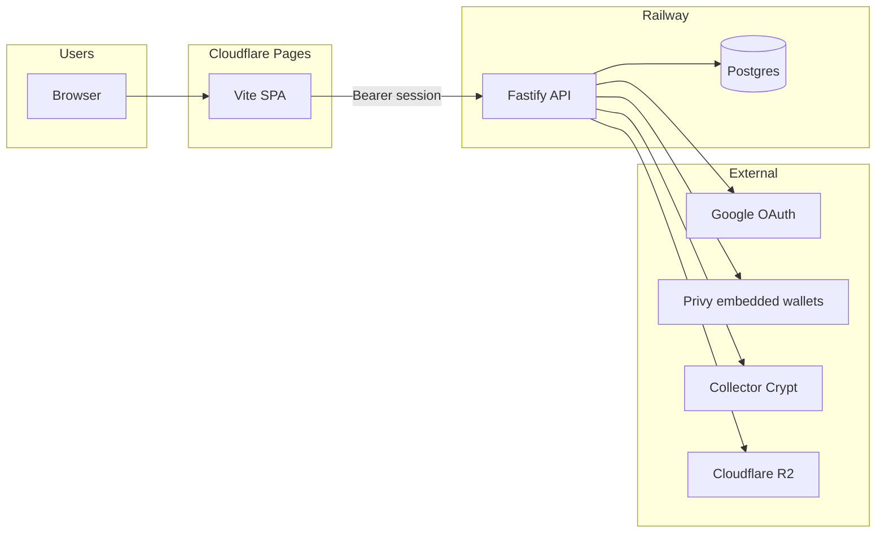

# Pocketpull

Digital pack opening and collector platform — web app, API, embedded Solana wallets, and Collector Crypt gacha integration.

<!-- Replace VIDEO_ID and link when your walkthrough is published -->
### Platform walkthrough

[](https://www.youtube.com/watch?v=VIDEO_ID)

**Video:** [Add your demo URL here](https://www.youtube.com/watch?v=VIDEO_ID) — local dev, Google login, Privy wallet, staging vs production.

---

## Repositories

| Repo | Stack | Role |
| ---- | ----- | ---- |
| [**Frontend**](https://github.com/Pocketpull/Frontend) | Vite, React 19, TypeScript, Privy, Solana wallet-adapter | SPA on **Cloudflare Pages** |
| [**Backend**](https://github.com/Pocketpull/Backend) | Node, Fastify, Drizzle, PostgreSQL | API on **Railway** |
| [**Platform docs**](https://github.com/Pocketpull/Pocketpull) | Markdown | Architecture, env matrices, demo video |

---

## How it fits together



1. User opens the **frontend** (production or staging URL).
2. **Sign in with Google** → API OAuth → redirect back with `#pp_token=`.
3. API provisions a **Privy embedded Solana wallet** and saves it to Postgres.
4. All game/commerce features call the **API** with the Bearer token.

---

## Live URLs

| Environment | Frontend | API |
| ----------- | -------- | --- |
| **Production** | [frontend-9a5.pages.dev](https://frontend-9a5.pages.dev) · [pocketpull.io](https://pocketpull.io) | [pocketpull-production.up.railway.app](https://pocketpull-production.up.railway.app) |
| **Staging** | Cloudflare Preview (`staging` branch) | [staging-pp-production.up.railway.app](https://staging-pp-production.up.railway.app) |
| **Local** | `http://localhost:8008` | `http://localhost:8080` |

---

## Auth & wallets (summary)

- **Login:** Google OAuth only (Apple planned).
- **Session:** Bearer token in SPA after OAuth callback (works cross-origin: Pages + Railway).
- **Wallet:** Privy server-side provisioning on Google sign-in; optional Phantom/Solflare for power users.
- **Not used for login:** Privy modal login, email/password.

---

## Quick start (developers)

```bash
# Terminal 1 — API
git clone https://github.com/Pocketpull/Backend.git
cd Backend && cp .env.example .env   # fill Google, Privy, DATABASE_URL
npm install && npm run db:migrate && npm run db:seed && npm run dev

# Terminal 2 — Web
git clone https://github.com/Pocketpull/Frontend.git
cd Frontend && cp .env.example .env   # VITE_API_URL=http://localhost:8080
npm install && npm run dev
# → http://localhost:8008
```

Full detail: [Frontend README](https://github.com/Pocketpull/Frontend) · [Backend README](https://github.com/Pocketpull/Backend) · [Platform README](https://github.com/Pocketpull/Pocketpull/blob/main/README.md)

---

## Staging without duplicate code

- Git branches: `main` (prod) · `staging` (preview).
- Railway: `pocketpull` + `Staging-pp` (separate Postgres).
- Cloudflare: **Production** vs **Preview** env vars (`VITE_API_URL` points at the matching API).

Templates: `Frontend/.staging.env` · `Backend/.staging.env`

---

<p align="center">
  <sub>Pocketpull · Obelisk Protocol</sub>
</p>
